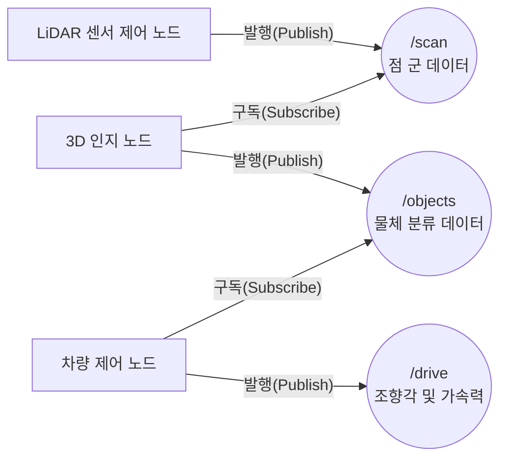

# 🔄 자율주행 201: ROS 2 통신망과 Sim-to-Real, 그리고 운영 인프라의 필요성

[👈 이전 과정 101](./자율주행-101-생초보-특강.md) | [🏠 인덱스로 돌아가기](./README.md) | [다음 과정 301 👉](./자율주행-301-엔지니어-딥다이브.md)

자율주행 아키텍처를 진정으로 이해하기 위해 넘어야 할 첫 번째 관문은 **로봇 운영 체제(Robot Operating System 2, ROS 2)** 통신 미들웨어(Middleware)입니다. 이 문서에서는 센서 데이터의 교환 방식과 시뮬레이션 환경이 물리적 실제와 어떻게 동일한 논리로 동작할 수 있는지 실무적인 관점에서 구조화합니다.

---

## 1. ROS 2: 모듈 간 게시판 통신 시스템

자율주행은 단일 프로그램 덩어리가 아닙니다. 거리 탐지 라이다(LiDAR)를 읽어내는 프로그램, 시각 이미지를 분석하는 프로그램, 모터 회전 속도를 결정하는 프로그램 등 수십 개의 작은 프로세스 블록인 **노드(Node)**들이 병렬적으로 돌아가는 구조입니다.

### 발행 / 구독 (Publisher / Subscriber) 아키텍처
ROS 2는 이 노드들이 서로 효율적으로 데이터를 교환하기 위해 **토픽(Topic)**이라는 비동기 채널 방식 아키텍처를 채택했습니다.

- 데이터를 생산하는 컴포넌트는 정보를 특정 토픽에 올리고(**Publish**), 데이터가 필요한 컴포넌트는 해당 토픽을 읽어 들이기만(**Subscribe**) 하면 됩니다. 
- 노드들은 서로의 네트워크 주소(IP)를 몰라도 내장된 데이터 분산 서비스(Data Distribution Service, DDS)가 자동으로 연결점을 찾아냅니다.

---

## 2. 가상에서 현실로 (Sim-to-Real Transition)

이러한 분산 처리 아키텍처가 빛을 발하는 가장 큰 이유는, 단 한 줄의 인공지능 코드 변경 없이 가상 시뮬레이션 구조를 물리적인 로봇(실차)으로 확장하는 **Sim-to-Real** 철학을 가능하게 하기 때문입니다.

### CARLA와 실차가 완벽히 호환되는 이유
- **물리적 RC카(F1Tenth) 주행 시**: 실제 물리 라이다 센서가 벽면 거리를 튕겨내어 `/scan` 토픽에 적재합니다.
- **가상 현실(CARLA) 주행 시**: 게임 엔진 기반의 알고리즘 봇이 가상의 광선을 쏘아 생성한 거리를 동일한 규격의 `/scan` 토픽에 적재합니다. 

인지(Perception) 노드 및 최적화 제어 알고리즘은 단지 `/scan` 데이터를 받아와서 수학적 계산 후 `/drive` 값으로 배출할 뿐입니다. 이 센서값이 렌더링 엔진에서 생성된 가짜인지 현실 세계의 정보인지 제어기 측은 알 필요가 없습니다. 
이러한 설계가 시뮬레이션 환경에서의 대규모 검증(Validation)을 가장 신속하게 제품화(Production)로 이끕니다.

---

## 3. 프로덕션 배포 시 맞닥뜨리는 거대 병목 (Bottleneck)

하지만, 실험실 컴퓨터를 벗어나 포장된 도로로 시스템이 포팅(Porting)되는 순간, 예측 불가능한 체계 유지(Maintenance)의 장벽이 치솟기 시작합니다.

### 1️⃣ 거대한 로깅(Logging) 폭포와 네트워크 대역폭 마비
차량 한 대가 초당 수집하는 센서 배열 데이터 스트림은 평균 수 기가바이트(GB)에 달합니다. 
장애 상황 분석을 위해 이 전체 구조를 원격 클라우드로 일괄 전송(Upload) 한다면 내부망 통신은 순식간에 교착 상태(Deadlock)에 부딪히며 엄청난 요금 청구가 수반됩니다. 데이터를 무조건 보내는 것이 아니라, 엣지(차량 탑재 컴퓨터)에서 핵심 이상 징후(Anomaly)만을 압축하여 필터링하는 파이프라인 없이는 사업의 손익분기점을 맞출 수 없습니다.

### 2️⃣ 환경 변수 파라미터 불일치 (Configuration Drift)
어제 맑은 도로에서 안전 주행 인증을 통과한 파라미터가 오늘 폭우가 쏟아지는 날씨에서는 인지 오류를 속출시킵니다. 원인은 프로그램 로직의 붕괴(Bug)가 아닌 레이저 빛 반사 노이즈 값을 조정해 주는 수 백가지 **파라미터(Parameter)** 환경 미조정 때문입니다. 이를 위해 개발자가 수십 대의 차량에 일일이 USB를 꽂고 파일 설정을 조작(Calibration)하는 수작업은 시스템적 병목입니다.

---

## 4. Sentinel Systems: 통제 불능 인프라의 관제 통합

오픈 소스 코드인 자율 주행 모듈에 막대한 자본과 엔지니어링이 엮이면 상업재가 되도록 돕는 것이 **센티넬 시스템즈(Sentinel Systems)**의 진정한 포지셔닝입니다.

1. **지능형 이벤트 클리핑 (Intelligent Event Clipping)** 
   - Sentinel 백그라운드 모델은 모든 데이터를 전송하지 않습니다. 순환 버퍼(Ring Buffer) 체계에 센서 비디오를 담아두다가 인공지능이 "특정 목표 분류 실패 확률이 임계치를 넘었습니다"라고 보고할 때만, 사고 추정 시간 전후 15초의 데이터만 가공하여 클라우드(Cloud) 스토리지에 보고합니다.

2. **동적 파라미터 대량 주입 (Over-The-Air Parametric OTA)**
   - 비가 쏟아지면 중앙 관제사는 모니터 상의 `Rainy Day Profile (우천 시 최적화 모드)` 버튼 하나를 누릅니다. 이를 수신한 Sentinel 통합 브로커가 무선 통신망을 타고 소속된 트럭 100대의 내부 노드 구조에 난입, 라이다 노이즈 필터링 계수와 브레이크 제동 유격률을 동적으로 재설정합니다. 차량을 단 한 대도 기지로 돌려보내지 않은 채 날씨 대응이 종료됩니다.

이렇듯 실험적인 오픈소스 커뮤니티의 기술을 '수익성을 보장하는 통제 가능 자본'으로 역전시키는 인프라 통제 소프트웨어. 바로 이것이 상업 자율주행 시장에서 Sentinel 플랫폼이 필연적으로 존재해야 할 첫 번째 논리입니다.

---
[👈 이전 과정 101](./자율주행-101-생초보-특강.md) | [🏠 인덱스로 돌아가기](./README.md) | [다음 과정 301 👉](./자율주행-301-엔지니어-딥다이브.md)
