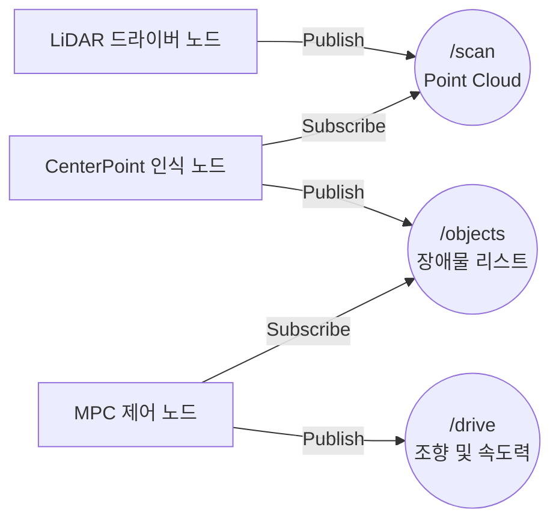

# 🔄 자율주행 201: ROS 2 통신망과 Sim-to-Real, 그리고 운영 인프라의 필요성

자율주행 아키텍처를 이해하는 첫 번째 산은 바로 **ROS 2(Robot Operating System)** 통신 미들웨어입니다. 이 문서에서는 센서 데이터가 어떻게 처리되고, 왜 시뮬레이션(CARLA)과 실차가 똑같이 동작할 수 있는지 실무적인 관점에서 구조화합니다.

---

## 1. ROS 2: 거대한 '게시판' 통신 시스템

자율주행은 단일 프로그램이 아닙니다. 라이다(LiDAR) 센서를 읽는 프로그램, 이미지를 분석하는 프로그램, 모터 회전수를 결정하는 프로그램 등 수십 개의 작은 프로그램(노드, Node)들이 동시에 돌아가는 구조입니다. 

### Publisher / Subscriber 아키텍처
ROS 2는 이 노드들이 서로 효율적으로 대화하기 위해 **Topic(토픽)**이라는 채널형 아키텍처를 사용합니다.

- 데이터를 생산하는 쪽은 토픽이라는 게시판에 데이터를 올리고(**Publish**), 데이터를 사용해야 하는 쪽은 그 게시판을 구독(**Subscribe**)하기만 하면 됩니다. 
- 이들은 서로가 누구인지(IP가 무엇인지) 몰라도 DDS(Data Distribution Service) 미들웨어가 자동으로 매칭하여 통신을 연결합니다.

---

## 2. Sim-to-Real (시뮬레이션에서 무결성 이식)

ROS 2의 분산 아키텍처가 빛을 발하는 가장 큰 이유는 바로 **Sim-to-Real (시뮬레이션을 코드 한 줄 수정 없이 실차로 전환)** 철학 때문입니다.

### 어떻게 코드 수정 없이 CARLA와 실차를 넘나드는가?
- **F1Tenth 실차 주행 시**: 라이다 센서 드라이버가 `/scan` 토픽에 실제 레이저 거리 정보를 올립니다.
- **CARLA(가상현실) 주행 시**: CARLA의 C++ 클라이언트가 **가상의** 레이저 거리 연산값을 똑같이 `/scan` 토픽에 올립니다. 

중간의 위치 추정(NDT), 인지(CenterPoint), 제어(MPC) 알고리즘 노드들은 그저 `/scan`을 구독하고 `/drive`를 발행할 뿐입니다. 이 정보가 언리얼 엔진에서 온 것인지, 진짜 도로에서 온 것인지 이들은 전혀 알지 못합니다. 
이 덕분에 가상 환경의 학습 데이터와 통제 파이프라인이 즉각적으로 프로덕션에 호환 가능해집니다.

---

## 3. 현장에서 맞닥뜨리는 거대한 통신 장벽

ROS 2 기반의 시스템을 현장에 포팅(Porting)하고 나면 예상치 못한 시스템 운영(Operations)의 장벽들이 튀어나옵니다.

### 1️⃣ 거대한 로깅(Logging) 대역폭 포화
차량 한 대가 초당 수집하는 센서 및 노드 통신 데이터는 수 기가바이트(GB)에 달합니다. 
자율주행차의 사고를 분석하거나, 강화학습을 위해 이 데이터를 원격 클라우드로 모두 전송해야 한다면? 통신망 대역폭은 순식간에 터지거나 과금이 천문학적으로 발생합니다. 데이터의 가치를 압축하고 필요한 상태(Event/Diagnosis)만 엣지에서 걸러 보내는 기술이 없다면 운영비용이 R&D 비용을 능가하게 됩니다.

### 2️⃣ 배포의 일관성 (Configuration Drift)
어제까지 잘 동작하던 코드가 오늘 아침 차량 3대에서만 오작동합니다. 원인은 코드 버그가 아니라, NDT(위치 추정) 수렴 파라미터가 비가 온다는 환경 변화를 반영하지 못했기 때문입니다. 현장에서 ROS 파라미터를 YAML 단위로 일일이 튜닝(Calibration)하는 것은 엔지니어링의 병목입니다. 

---

## 4. Sentinel Systems: B2B 통신 인프라의 가치

이 시점에서 **Sentinel Systems**의 진정한 역할이 시스템 엔지니어의 골칫거리를 대신 해결하는 솔루션으로 나타납니다.

1. **지능형 이벤트 로그 압축 (Intelligent Log Aggregation)** 
   - Sentinel 프레임워크는 모든 센서 로우(Raw) 데이터를 스트리밍하지 않고, 차량 내부에 블랙박스 버퍼를 두어 자율주행 모듈이 **"Confidence(확률)가 급격히 떨어지는 이벤트"**를 감지했을 때만 사고 발생 전후 15초의 데이터를 클라우드로 쏴주는 관제 채널망 역할을 수행합니다.

2. **OTA 기반 멀티 노드 파라미터 자동화 (Parametric Fleet Control)**
   - 비가 내리면 관리자는 관제 시스템에서 `Rainy Day Profile`을 클릭합니다. Sentinel은 인터넷을 타고 차량의 ROS 2 파라미터 노드에 즉각 개입하여 라이다의 반사 노이즈 필터링 강도를 올리고, 차량의 횡방향 미끄럼(Slip) 허용치를 동적으로 업데이트하여 차량 100대를 일제히 기후 변경 모드에 안착시킵니다.

단순한 오픈소스 ROS 2를, **현금 흐름을 창출하는 상용 인프라 자산**으로 변환하는 교두보. 이것이 Sentinel 아키텍처가 제공하는 마일스톤의 핵심입니다.
