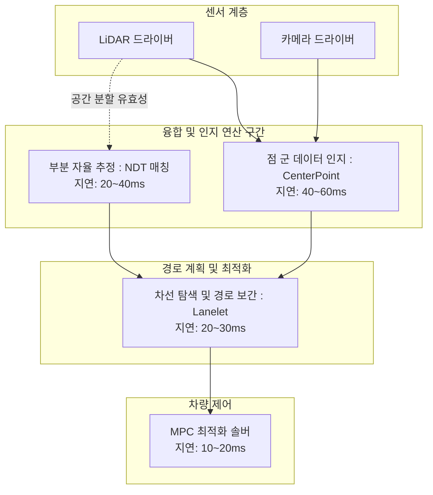

# ⚙️ 자율주행 301: 엔지니어를 위한 DAG 파이프라인과 알고리즘 심화

[👈 이전 과정 201](./자율주행-201-초중급-특강.md) | [🏠 인덱스로 돌아가기](./README.md) | [다음 과정 401 👉](./자율주행-401-시니어-아키텍트.md)

이 과정은 자율주행 개발의 실무 최전선에 있는 **로보틱스 엔지니어 및 중/고급 개발자**를 위한 문서입니다. 
최신 자율주행 스택이 어떻게 방향성 비순환 그래프(Directed Acyclic Graph, DAG) 형태로 뻗어져 지연(Latency) 통제와 구조적 무결성 원리를 지켜내는지, 그리고 제어 연산 최적화가 실제 주행에 미치는 파괴력을 집중 해부합니다.

---

## 1. 방향성 비순환 그래프 (DAG) 체제와 최장 지연 한계 (Maximum Latency Budget)

실제 상용 시스템 아키텍처의 데이터 흐름은 하나의 거대한 분산 통신 그래프이며, 이 연산 지연의 제어가 자율주행 코어 엔지니어링의 시작이자 끝입니다.

### E2E 지연 한도 모형 (시속 100km 주행 시 가용 250ms 이하 규제)

1. **인지 병목(Perception Bottleneck)**: 인공지능(AI) 텐서 코어 추론 구간. 이 제한 시간(명세된 60ms)을 단 한 프레임이라도 초과 시, 뒤이은 플래닝 노드가 유령(물체의 낡은 과거 위치)을 포착하고 긴급 제동 패널티(Lag Penalty)를 발동시킵니다.
2. **단방향 규제**: 위 그래프에 표기되듯 연산 흐름은 절대 역방향으로 순환(Cyclic)되지 않아야 예측 가능한 보장된(Deterministic) 반응 속도 방어가 가능합니다.

---

## 2. NDT와 EKF의 융합 — 공분산(Covariance Matrix) 튜닝 기법

자율주행 시스템이 스스로의 위치를 찾는다는 것은 NDT(정규 분포 변환) 형태 매칭 데이터의 확률 의존성과 내부 IMU(관성 모듈) 계측치 추정을 수학적으로 조율하는 예술입니다. 

- **오차 발생 조건**: NDT는 밀집된 도심 구조에서는 추정 신뢰도가 높으나, 터널 같은 단조로운 축척 도로에서는 종방향 수렴에 실패하게 됩니다. 반대로 타이어 엔코더(Encoder) 속도 및 IMU는 짧은 반응 시간에는 막강하나 시간이 지날수록 위치 값이 미끄러지는 드리프트 현상(Drift)에 부딪힙니다.
- **확장 칼만 필터(Extended Kalman Filter, EKF) 융합 설계**: 
  이 둘 사이의 충돌 딜레마를 해결하기 위해 EKF가 가중 조율(Kalman Gain)의 심장으로 들어섭니다. 
  엔지니어는 터널 같은 특수 환경에서 NDT가 `[x, y]`방향으로 송출해 내는 오차 공분산(Covariance Matrix)의 임계 행렬 값을 동적으로 낮추는 방편으로 튜닝합니다. 터널 안에서는 환경 센서(LiDAR NDT)의 신뢰도를 0.1로 과감히 내리고 내부 측정 관성 센서(IMU) 가중치를 압도적으로 올리는 시간별 확률 맵 최적화가 모델 강건성의 핵심입니다.

---

## 3. 선형 예측 제어(MPC) 메커니즘과 비용 함수 조율(Cost Function Adjustment)

F1Tenth 규격의 소형 차량에서는 조향각 오차만 교정하는 PID 제어가 유효할 수 있으나, 무거운 실차의 질량 관성 한계를 돌파하기 위해서는 미래 차체 거동 곡선을 내다보고 엑셀러레이터를 예열시키는 **모델 예측 제어(Model Predictive Control, MPC)**가 절대적 우위를 가집니다.

### 실제 승차감을 결정짓는 파라미터 방정식 $J$
MPC 2차 제어 비용 함수(Quadratic Cost Function)의 뼈대는 통상적으로 다음과 같습니다.
$$ J = \sum (w_{lat} \cdot e_{lat}^2 + w_{yaw} \cdot e_{yaw}^2 + w_{steer} \cdot u_{s}^2 + w_{jerk} \cdot {\Delta u_{s}}^2) $$

1. **오차 페널티 ($w_{lat}$, $w_{yaw}$)**: 차량을 중앙선에 단 1cm 오차 없이 고정시키려면 이 값을 극단적으로 높이면 됩니다. 그러나 높은 가중치는 반대 급부로 운전대를 요동치게 만드는 미세 지그재그 진동(Oscillation) 주행을 유발합니다.
2. **충격 페널티 ($w_{jerk}$)**: 임원 차량 및 택시처럼 운전자 탑승감이 최우선인 목표 함수에서는 이 가속도 변화율(Jerk)의 페널티 상수를 폭발적으로 올립니다.
결국 단 하나의 C++ 로직 변경을 가하지 않고 텍스트 파일(YAML) 구성(Configuration)의 수 조합만으로 그 차량이 레이싱 트랙의 경주마 체질이 될지 최고급 리무진 기반 거동을 보여줄지 결정됩니다. 

---

## 4. 원격 아키텍트 주관의 파라미터 배포 (Parameter Pipeline) 구조 

**센티넬 시스템즈(Sentinel Systems)**의 아키텍처는 이 지점에서 강력한 인프라스트럭처 자산으로 활약합니다.

결국 위에서 언급된 **DAG 통신 병목**, **EKF 파라미터 드리프트**, **MPC 함수 미분 조건 발산**은 통제된 개발형 컴퓨터가 아닌 거친 야생 도로 위 수 십대의 차량에서 쏟아집니다.
- 차량 내부의 물리 단자를 해체하여 파일(YAML) 값을 수정하는 오프라인 튜닝은 기업 입장에서 절망적인 조치입니다. 대신 Sentinel 중심 클라우드는 OTA (Over-The-Air) 무선 체계를 기반으로 차량의 ROS 2 노드를 런타임에 안전 격리하고 특정 파라미터 트리를 무중단 업데이트해냅니다.
엔지니어가 고안한 핵심 방정식 튜닝 값을 수 백대의 거대 클러스터 자산(Fleet) 전체에 안전하게 밀어붙이는 무결의 데이터 유통 배관망 확보. 이것이 엔지니어의 로직이 제품의 가치로 격상하는 최종 파이프라인 관통력이라 하겠습니다.

---
[👈 이전 과정 201](./자율주행-201-초중급-특강.md) | [🏠 인덱스로 돌아가기](./README.md) | [다음 과정 401 👉](./자율주행-401-시니어-아키텍트.md)
